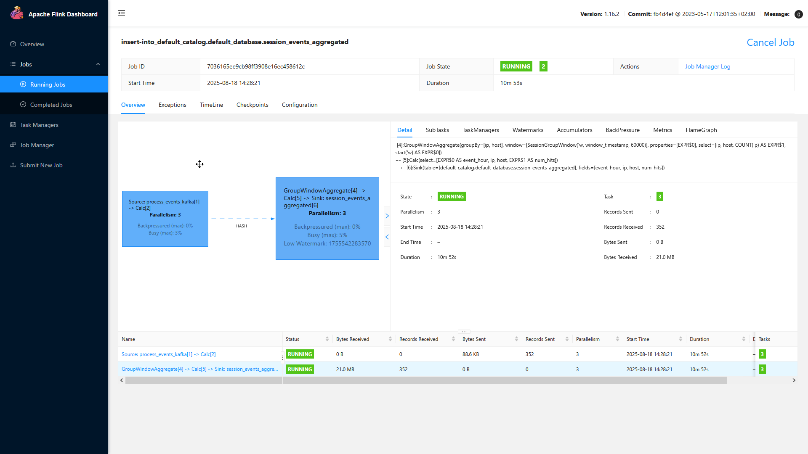
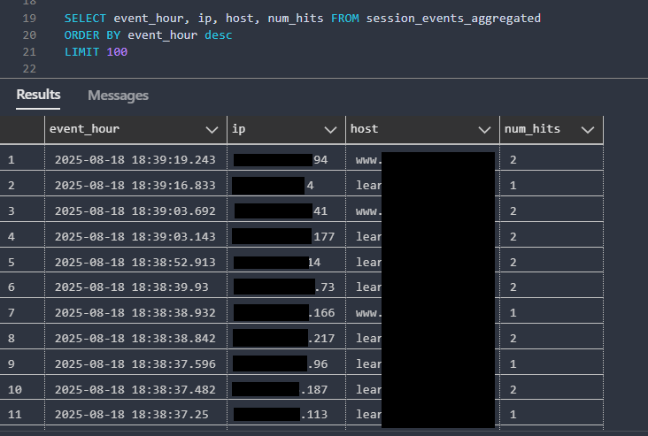

# Web Traffic Processing with Apache Flink
A real-time web traffic processing pipeline using **Apache Flink**, **Kafka**, and **PostgreSQL**. Ingests raw web events, enriches them with geolocation information, and performs both fixed-time and session-based aggregations.


---




## Flink Jobs

### 1. Event Enrichment Job
- **Purpose:** Consumes raw events from Kafka and enriches them with geolocation data using the [IP2Location API](https://api.ip2location.io).  
- **Geolocation API** Retrieves `country`, `state`, and `city` from IP addresses. 
- **Output:**
  - PostgreSQL table `processed_events`  
  - Kafka topic `process_events_kafka` (enriched data for downstream jobs)  

### 2. Aggregated Event Counts Job
- **Purpose:** Performs 5-minute tumbling window aggregations on enriched events.  
- **Output:**
  - `processed_events_aggregated` → hits per host  
  - `processed_events_aggregated_source` → hits per host and referrer  

### 3. Sessionized Aggregation Job
- **Purpose:** Creates dynamic session windows based on IP and host, closing after 1 minute of inactivity.  
- **Output:**  
  - `session_events_aggregated` → hits per user session  

---

Sessionized data inside Postgres





## Project Setup

### Environment
- **Flink Dashboard:** [http://localhost:8081](http://localhost:8081)  
- **PostgreSQL Credentials:**  
  ```text
  POSTGRES_SCHEMA=postgres
  POSTGRES_USER=postgres
  POSTGRES_DB=postgres
  POSTGRES_PASSWORD=postgres
  ```


## Starting Flink and Docker Environment
```bash
docker compose --env-file flink-env.env up --build --remove-orphans -d
```

## Running Flink Jobs
```bash
# Enrichment job
docker compose exec jobmanager ./bin/flink run -py /opt/src/job/processing_job.py --pyFiles /opt/src -d

# Aggregation job (fixed 5-min window)
docker compose exec jobmanager ./bin/flink run -py /opt/src/job/aggregation_job.py --pyFiles /opt/src -d

# Sessionized aggregation job
docker compose exec jobmanager ./bin/flink run -py /opt/src/job/session_job.py --pyFiles /opt/src -d
```


